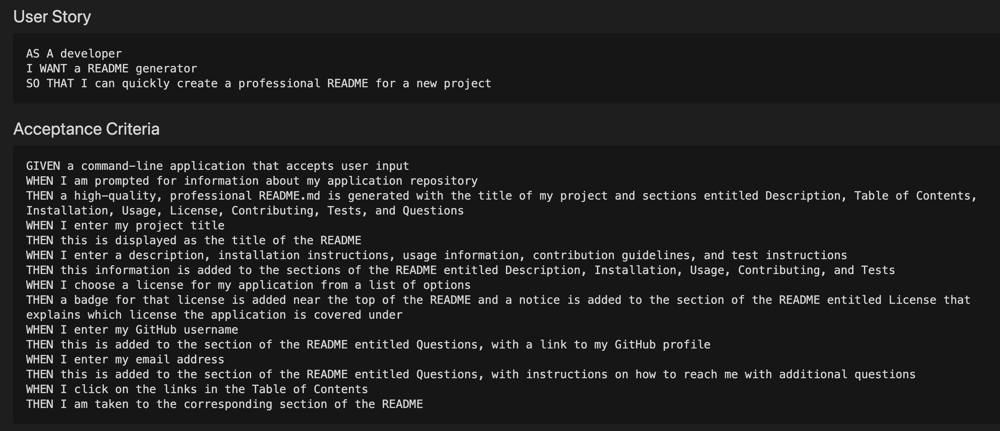

# README.md Generator
## 


## Table of Contents:
<ol>
<li><a href="#description">Description</a></li>
<li><a href="#installation">Installation</a></li>
<li><a href="#usage">Usage</a></li>
<li><a href="#contributing">Contributing</a></li>
<li><a href="#questions">Questions</a></li>
<li><a href="#license">License</a></li>
</ol>

## Description :
When using GitHub, it is important to have a professional README available to users.  This information will contain information about the app - how it is used, how it is installed, how to test it, how to contribute, and what license was used.   This README generator will take the stress out of having to make a README for the users.   Simply by entering information about the app via the command line, they can have a wonderful README. 
Here are the accepatance criteria given:



## Installation :
The application can be run in the termianl inside of your chosen coding application. It uses Javascript and Node as the languages to access it. 
The application is invoked by using the following command:
```bash
node index.js
```

## Usage : 
The user will open the project inside the chose coding platform.  The user will then run node index.js inside the command line.   After running that code, the user is prompted with questions about the project done.   After answering these questions, the user then will have a professional README created that they can use.


## Contributing :
Pull requests are always welcome.  When contributing to this repository, please first discuss the change you wish to make via email or issue.  
After approval, please follow the "fork-and-pull" Git workflow.
<ol>
<li>Fork the repo on GitHub</li>
<li>Clone the project to your own machine</li>
<li>Commit changes to your own branch</li>
<li>Push your work back up to your fork</li>
<li>Submit a Pull request so that we can review your changes</li>
</ol>

## Questions :

If you have any questions, feel free to reach out to me.   My email is ckhilpisch@gmail.com.

## License :

MIT License
Informataion avaiable here: 
https://opensource.org/licenses/MIT


