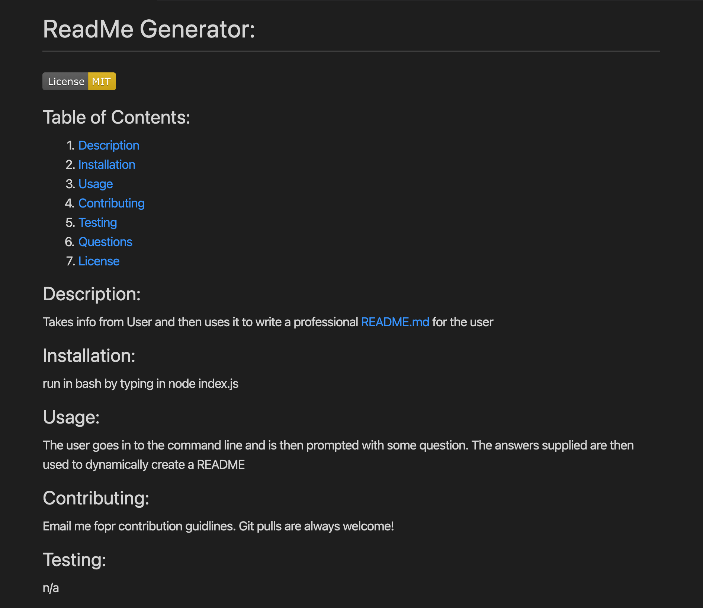
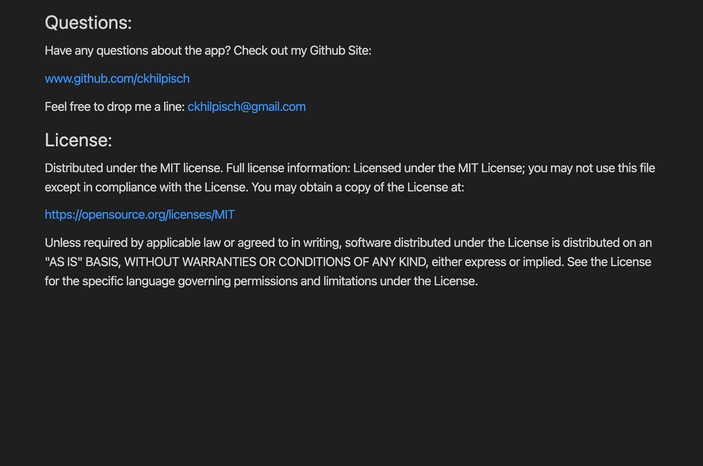

## 


# README.md Generator

## <div align="center"> **Table of Contents** :</div>

* [Description](#description)
* [Installation](#installation)
* [Usage](#usage)
* [Visuals](#visuals)
* [Contributing](#contributing)
* [Questions](#questions)
* [License](#license)

## <div align ='center'> <a name="description"> **Description** :</a></div> 
When using GitHub, it is important to have a professional README available to users.  This information will contain information about the app - how it is used, how it is installed, how to test it, how to contribute, and what licensing was used.   This README generator will take the stress out of having to make a README for users.   Simply by entering information about the user's app via the command line, a wonderful README is dynamically created. 


## <div align ='center'> <a name="installation"> **Installation** :</div> 
The application can be run in the termianl inside of your chosen coding application. It uses Javascript and Node as the languages to access it. 
The user must make sure to use the following code so that the inquirer is available to them:
```bash
npm i
```
The application is invoked by using the following command:
```bash
node index.js
```

## <div align="center"><a name="usage"> **Usage** :</a></div>
The user will open the command terminal inside the chosen coding platform.  The user will then run node index.js inside the command line.   After running that code, the user is prompted with questions about the user project.   After answering these questions, the user then will have a professional README created for use.

## <div align="center"><a name="visuals"> **Visuals** :</a></div>





Here is a link to a walk through tutorial of the app:
https://drive.google.com/file/d/11zVUKfvxbtjTVjHBwobkhXaOlid-9TMu/view?usp=sharing


## <div align="center"><a name="contributing"> **Contributing** :</a></div>
Pull requests are always welcome.  When contributing to this repository, please first discuss the change you wish to make via email or issue.  
After approval, please follow the "fork-and-pull" Git workflow.
<ol>
<li>Fork the repo on GitHub</li>
<li>Clone the project to your own machine</li>
<li>Commit changes to your own branch</li>
<li>Push your work back up to your fork</li>
<li>Submit a Pull request so that we can review your changes</li>
</ol>

## <div align="center"><a name="questions"> **Questions** :</a></div>

If you have any questions, feel free to reach out to me.   My email is ckhilpisch@gmail.com.

## <div align ='center'> <a name="license"> **License** : </a></div> 


MIT License
Informataion avaiable here: 
https://opensource.org/licenses/MIT


